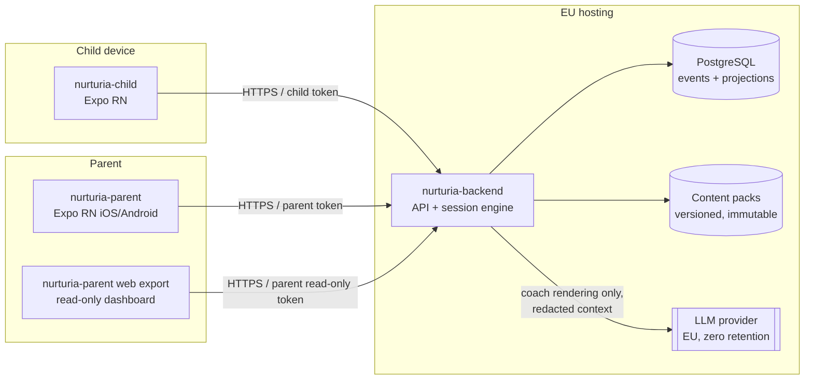
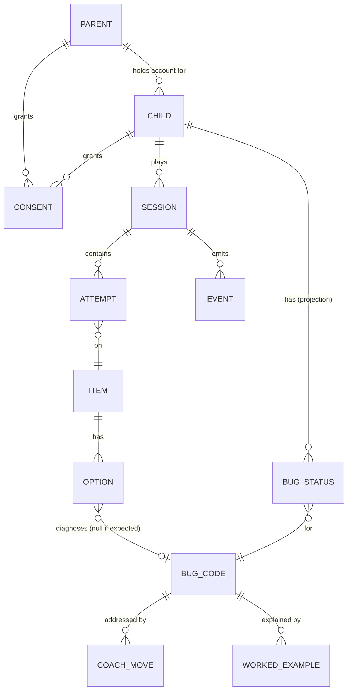
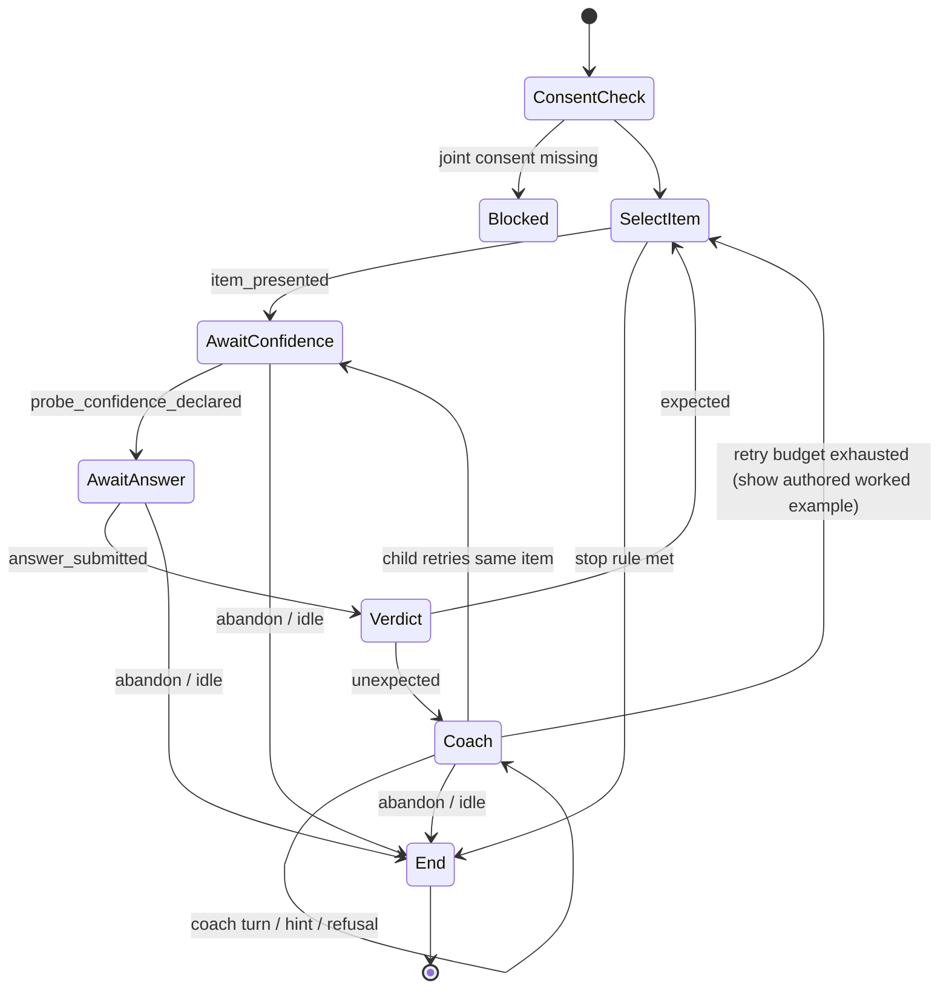
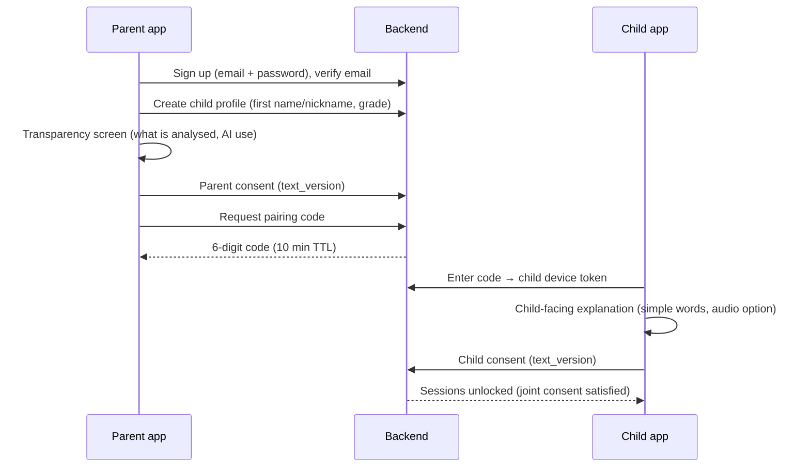

# Nurturia — MVP Architecture

> Status: draft v0.1 · 2026-09-30
> Scope: fractions only, CM2 and 6e. Parents are the account holders.
> Mobile stack: **React Native (Expo)**, decided 2026-09-30.

> **⚠ Superseded on one point — 2026-10-03.** The product stays a **single mobile app**
> that switches between parent mode and child mode, with the exit from child mode protected
> by the 6-digit parent code (`CLAUDE.md` §1 and §6, `docs/PARCOURS.md` §3). There is **no
> separate `nurturia-child` / `nurturia-parent` pair of apps and no device pairing.**
>
> Sections affected and no longer valid as written: §2 (system diagram, repository table:
> the two Expo repos become one app), §3 (`device_pairing`), §4.1 step 1 (pairing screen),
> §9 (pairing step of the flow), §11.3 (`/pairing-codes`, `/pairing/redeem`), §13 (child
> device token from pairing), §15 steps 3–4.
>
> **Everything else in this document is still a draft, not a decision.** In particular the
> backend stack and EU hosting (§2, §13), the "no photos / no microphone" constraint (P7,
> §4.4), the resolution thresholds (§6.5, D3) and the worked example (D2) remain open in
> `DECISIONS-OUVERTES.md` (§2.1, §7.4, §7.5, §7.6).

---

## 1. Product principles (these constrain every design choice)

| # | Principle | Consequence in the architecture |
|---|-----------|---------------------------------|
| P1 | **Verdicts are deterministic.** | `expected`/`unexpected` and `bug_code` come from a lookup of the chosen option in authored content. No LLM is on this path, and nothing in the verdict path can call one (see §6.3). |
| P2 | **The coach never gives the answer.** | The coach's context never includes the expected answer or which option is correct. Any worked solution comes from pre-authored content (§7). |
| P3 | **Orchestration is deterministic, not agentic.** | The session is an explicit state machine (§6). The LLM is a *renderer* inside one state. It never chooses the next step. |
| P4 | **The engine does not depend on content.** | Content is versioned data that meets a schema. Engine tests run on a synthetic content pack (§8.4). |
| P5 | **Parents see diagnosis, not scores.** | The dashboards show `bug_code`s and whether they are resolved over time. There are no grades, percentages, rankings or comparisons. |
| P6 | **No engagement mechanics.** | No points, streaks, XP, leaderboards, leagues, rewards or lotteries. CI enforces this (§12). |
| P7 | **Data minimisation.** | No photos, no homework scanning, no location, no cross-app tracking, no ad SDKs, no birth dates. |

**Counter-model (Wilgo):** child-only, gamified, and the AI explains solutions. It has no parent product. Nurturia is the opposite on each of these points: parent-centred, not gamified, Socratic, and its explanations are authored.

---

## 2. System overview



### Repositories (three, as specified)

> **Superseded (2026-10-03):** `nurturia-child` and `nurturia-parent` are one app, this
> repository. See the note at the top of the document.

| Repo | Stack | Contents |
|------|-------|----------|
| `nurturia-backend` | TypeScript, Node 22, Fastify, PostgreSQL, Drizzle ORM, Zod | API, session state machine, verdict engine, coach orchestrator, event store, projections, consent. It also holds `/content` (authored packs + schemas + validator) and `/openapi` (the contract, source of truth). |
| `nurturia-child` | Expo (SDK current), Expo Router, TypeScript | The probe, the coach UI, child consent screen, and pairing. |
| `nurturia-parent` | Expo, Expo Router, TypeScript | Parent mobile app. The **read-only web dashboard is the web export of the same repo** (`expo export -p web`). It uses a restricted route set and a read-only token scope. |

**Why content lives in the backend repo:** there are three repos, and content has to be validated against the engine's schemas in the same CI run. Content is still separated by directory, owner (CODEOWNERS = pedagogy reviewers) and release cycle (packs are versioned independently of code). If authoring volume grows, move `/content` to a fourth repo without changing the engine.

**Shared types:** the backend publishes an OpenAPI spec. The apps generate typed clients with `openapi-typescript` in CI. No shared npm package is needed at MVP.

**Why TypeScript end to end:** one language across three repos for a small team, Zod schemas that serve both content validation and API validation, and type generation straight into React Native.

---

## 3. Domain model



| Entity | Key fields | Notes |
|--------|-----------|-------|
| `parent` | id, email (verified), locale, created_at | The account holder. Email is the only direct identifier stored. |
| `child` | id (pseudonymous UUID), parent_id, display_name (first name or nickname), grade (`CM2`\|`6e`) | **No birth date, surname, school or photo.** |
| `consent` | id, child_id, subject (`parent`\|`child`), scope, text_version, granted_at, withdrawn_at | Joint consent = both rows present and not withdrawn (§9). |
| `device_pairing` | child_id, device_key_hash, paired_at, revoked_at | The child app has no password. It is paired from the parent app. |
| `session` | id, child_id, content_pack_version, kind (`probe`\|`review`), state, seed, started_at, ended_at | `seed` makes item selection reproducible. |
| `attempt` | id, session_id, item_id, confidence (declared), option_id, verdict, bug_code, max_assistance_level | One row per answer submission. |
| `event` | see §5 | Append-only. The source of truth for analytics and the parent views. |
| `bug_status` | child_id, bug_code, status, first_seen_at, last_seen_at, resolved_at, evidence | A projection rebuilt from events (§6.5). |

Content entities (`item`, `option`, `bug_code`, `coach_move`, `worked_example`) are **not DB tables authored by hand**. They are loaded from an immutable, versioned content pack (§8).

---

## 4. Child app (`nurturia-child`)

> **Superseded (2026-10-03):** this is child mode inside the single app, reached by the
> parent switching modes. Step 1 (pairing) does not exist; leaving child mode requires the
> parent code (`docs/PARCOURS.md` §3).

### 4.1 Screens
1. **Pairing**: the child enters a 6-digit code shown in the parent app. The device gets a child-scoped token.
2. **Child consent**: an age-appropriate explanation with a single clear "D'accord" / "Pas maintenant" choice (§9). This is blocking.
3. **Home**: one action, "Commencer". No counters, badges or progress bars that measure volume.
4. **Probe item**: the question, then the **confidence step**, then the options.
5. **Coach panel**: opens after an `unexpected` verdict, or when the child asks for help.
6. **End of session**: a neutral close ("Merci, à bientôt"). No score.
7. **"Comment ça marche ?"**: the child-facing transparency page (§10).

### 4.2 Confidence before answer (`probe_confidence_declared`)
- The options are **hidden until confidence is declared.** The scale has 3 steps: "Je suis sûr·e" / "Je crois" / "Je ne sais pas".
- The server enforces the order. `POST /attempts/{id}/answer` returns `409` unless a `probe_confidence_declared` event exists for that `attempt_id`. The UI cannot bypass this.

### 4.3 Connectivity
The verdict is decided by the backend, so **an answer needs connectivity**. Events are queued locally (SQLite via `expo-sqlite`) and sent with idempotent `event_id`s. They can be retried, but offline play is out of MVP scope.

### 4.4 Build constraints
- No location, camera, microphone, contacts or photo-library permissions. CI checks `app.json` (§12).
- No IDFA/AAID, no ATT prompt, no analytics SDKs. Only first-party events go to our own backend.
- Target the Apple **Kids category** and the Google Play **Families** programme. Both forbid third-party analytics and ads for kids. This fits our constraints, so apply for both.

---

## 5. Event schema

### 5.1 Envelope (every event)

```jsonc
{
  "event_id": "018f…",            // UUIDv7, client-generated, idempotency key
  "event_type": "probe_confidence_declared",
  "schema_version": 1,
  "child_id": "c_…",              // pseudonymous
  "session_id": "s_…",
  "attempt_id": "a_…",            // null for session-level events
  "content_pack_version": "fractions-2026.10.0",
  "client_ts": "2026-09-30T14:03:11.120Z",
  "server_ts": "…",               // set by server
  "source": "child_app|server",
  "payload": { }
}
```

The server, not the client, is the **authoritative emitter** of verdict-derived events (`verdict_recorded`, `bug_resolved`). Clients emit only behaviour events. The server validates every payload with Zod and rejects unknown `event_type`s.

### 5.2 Catalogue

| Event | Emitted by | Trigger (deterministic) | Payload |
|-------|-----------|--------------------------|---------|
| `session_started` | server | Session is created | `kind`, `grade` |
| `item_presented` | server | Next item is selected | `item_id`, `targets: bug_code[]` |
| `probe_confidence_declared` | child_app | Child taps a confidence level, **before** any option is shown | `level: sure\|think\|unsure`, `latency_ms` |
| `answer_submitted` | child_app | Child selects an option | `option_id`, `latency_ms` |
| `verdict_recorded` | server | Verdict lookup (§6.3) | `verdict: expected\|unexpected`, `bug_code\|null`, `confidence_level`, `assistance_level` |
| `assistance_level` *(field on `verdict_recorded`, also queryable)* | server | — | Max level reached on this attempt before the verdict, 0–4 (§7.3) |
| `coach_turn` | server | The coach emits a message | `move_id`, `level`, `rendered_by: authored\|llm`, `guard_result` |
| `hint_offered` | server | The state machine offers a hint | `level` |
| `hint_declined` | child_app | Child taps "Non merci" on an offered hint, or dismisses it | `level_offered` |
| `answer_demanded` | child_app / server | Child taps "Donne-moi la réponse", **or** their free text matches the deterministic `answer_request` patterns (§7.4) | `channel: button\|text`, `pattern_id?` |
| `coach_refused` | server | Always follows `answer_demanded` | `refusal_move_id` |
| `post_refusal_behaviour` | server | First meaningful child action within 60 s after `coach_refused`, or the timeout | `behaviour: retried\|asked_hint\|asked_again\|abandoned\|idle_timeout`, `latency_ms` |
| `task_abandoned` | server | Session ends (app closed, "Arrêter", or 5 min idle) with an item that has no `expected` verdict | `item_id`, `last_state`, `assistance_level` |
| `bug_resolved` | server | **Primary event.** The `bug_status` projection moves to `resolved` (§6.5) | `bug_code`, `evidence_attempt_ids[]`, `sessions_span`, `days_since_first_seen` |
| `bug_reappeared` | server | A resolved bug is observed again | `bug_code`, `attempt_id` |
| `session_ended` | server | End state reached | `reason: completed\|abandoned\|timeout` |

**Primary metric:** `bug_resolved` per active child per 4 weeks, split by `bug_code`. The counter-metric is the `bug_reappeared` rate within 30 days of resolution.

---

## 6. Deterministic orchestration

### 6.1 Session state machine



- The machine is implemented as a **pure reducer**: `(state, event, contentPack, config) → (state', emittedEvents[])`. It has no I/O, no clock (time is passed in) and no randomness (a seeded PRNG from `session.seed`).
- The machine state is persisted after each transition. Replaying a session's events through the reducer must reproduce the same state. This is a property test in CI.
- The retry budget per item is 2 retries after the first `unexpected` (configurable).

### 6.2 Item selection (deterministic)
Each step picks the next item from the pack for the child's grade:
1. **Probe phase** (first session): a fixed, authored probe sequence of about 10 items that covers every `bug_code` family at least once.
2. **Follow-up sessions**: priority goes to bug_codes whose `bug_status` is `active` or `reappeared`. Pick items whose distractors target that bug_code and that the child has not seen in the last N sessions. Ties are broken by the seeded PRNG.
3. **Retest scheduling**: once a bug_code has its first `expected` on a targeted item, schedule the next retest at ≥ 1 day and then ≥ 3 days (spacing). This supplies the "over time" evidence for §6.5.
4. **Stop rule**: stop after 8 items or 12 minutes, whichever comes first. The session is kept short on purpose.

### 6.3 Verdict engine
```ts
verdict(item, optionId) =>
  option.is_expected ? { verdict: "expected", bug_code: null }
                     : { verdict: "unexpected", bug_code: option.bug_code }
```
- The verdict is a pure lookup in the content pack. The validator guarantees that every non-expected option has a `bug_code` (§8.3).
- **Isolation:** the verdict module sits in `src/engine/verdict/`. A lint rule (`no-restricted-imports`) forbids importing `src/coach/**`, `src/llm/**` or any HTTP client from `src/engine/**`. CI fails if it does.

### 6.4 What the LLM is allowed to do
The LLM does exactly one job. It **rephrases an authored Socratic move** so that it fits the child's last free-text utterance. It does not pick the move, the level, the next state or the verdict. If the LLM is unavailable or its output fails the guard, the authored text of the move is shown unchanged. **The product must work with the LLM switched off.** That is a supported configuration, and it is the default in tests.

### 6.5 Bug status and `bug_resolved` (deterministic rule)

Per `(child, bug_code)`:

| Status | Entry condition |
|--------|-----------------|
| `unseen` | default |
| `active` | ≥ 1 `unexpected` verdict with this bug_code |
| `resolving` | `active` or `reappeared`, and ≥ 1 later `expected` verdict on an item that **targets** this bug_code |
| `resolved` | ≥ 3 `expected` verdicts on targeting items, **across ≥ 2 distinct sessions on different days**, each with `assistance_level ≤ 1`, and **no** `unexpected` with this bug_code since the first of those 3 |
| `reappeared` | `resolved`, then another `unexpected` with this bug_code |

- `bug_resolved` is emitted on the transition to `resolved`. It can be emitted again after a `reappeared` cycle, and each emission carries its evidence attempt IDs.
- The thresholds (3, 2, ≤ 1) live in `config/resolution.yaml` and are versioned. The dashboard shows which rule version produced each status.
- An item *targets* a bug_code if at least one of its distractors is mapped to that bug_code. A correct answer on an item that offers the misconception as a trap is the evidence.

---

## 7. Socratic coach

### 7.1 What the coach receives (explicit allow-list)
```ts
type CoachContext = {
  grade: "CM2" | "6e";
  item_stem: string;              // the question as shown
  chosen_option_text: string;     // what the child picked
  bug_code: string;               // diagnosed misconception
  move: CoachMove;                // authored move selected by the state machine
  child_utterance?: string;       // last free text, max 200 chars
  level: 0|1|2|3|4;
};
```
It **never** receives: `is_expected` flags, the text of the expected option, the list of other options, worked examples for the current item, the child's name, or any identifier. `CoachContext` is built by a single function with a unit test asserting that none of the forbidden fields are present. The coach module cannot import the content-pack accessor for options at all. It only gets the projection above.

### 7.2 Output guard (runs outside the LLM, and the guard *does* know the answer)
The server (not the LLM) checks every LLM output before it is shown:
1. It must not contain the expected option's text, value, or any equivalent form. The server computes equivalents: equivalent fractions up to a denominator of 100, the decimal, the percentage, and the words ("trois quarts").
2. It must not contain an imperative "la réponse est…" pattern, and it must end with a question.
3. Length ≤ 280 chars, French, with no URLs.

If any check fails, the authored move text is used instead, and `coach_turn.guard_result = "fallback"` is logged.

### 7.3 Assistance levels (per attempt)
| Level | What the child gets | Source |
|-------|---------------------|--------|
| 0 | Nothing (answered alone) | — |
| 1 | A Socratic question about their reasoning ("Comment as-tu trouvé 2/7 ?") | Authored move, optionally LLM-rephrased |
| 2 | A targeted hint about the misconception (e.g. "Que représente le nombre du bas ?") | Authored, may be rephrased |
| 3 | A representation hint (an authored diagram: a bar, a number line) | Authored only |
| 4 | A **worked example of an isomorphic item** (different numbers, same structure). Then the child retries the original item. | Authored only, never generated. It never shows the current item's solution. |

`assistance_level` on `verdict_recorded` = the highest level reached on that attempt.

### 7.4 Answer demands
- **Button** "Donne-moi la réponse": it is always visible in the coach panel. Removing it would hide the behaviour we want to measure.
- **Free text**: deterministic regex/keyword patterns in French (`/(donne|dis)[- ]moi la (bonne )?réponse/i`, `c'est quoi la réponse`, …), authored and versioned in `content/coach/answer_request_patterns.yaml`. This is classification only. No LLM is involved.
- On a demand, the coach refuses warmly with an authored refusal move ("Je ne vais pas te la donner, mais on peut la trouver ensemble. Par quoi veux-tu commencer ?"). Then it logs `coach_refused` and starts the `post_refusal_behaviour` window.

---

## 8. Content as data

### 8.1 Layout (`nurturia-backend/content`)
```
content/
  schema/                 # JSON Schema generated from Zod (single source)
  packs/fractions/
    pack.yaml             # id, version, grades, locale, status
    bug_codes.yaml
    items/*.yaml
    coach_moves.yaml
    worked_examples/*.yaml
    parent_copy.yaml      # parent-facing labels and tips per bug_code
  coach/answer_request_patterns.yaml
  fixtures/synthetic/     # fake pack used by engine tests (not fractions)
```

### 8.2 Example
```yaml
# bug_codes.yaml
- code: FRAC_ADD_ACROSS
  family: operations
  description_internal: "Adds numerators together and denominators together (1/2 + 1/3 = 2/5)."
- code: FRAC_BIG_DENOM_BIGGER
  family: comparison
  description_internal: "Believes a larger denominator means a larger fraction (1/8 > 1/4)."
- code: FRAC_NUMLINE_COUNT_TICKS
  family: number_line
  description_internal: "Counts tick marks instead of intervals when placing a fraction."
- code: FRAC_EQUIV_ADDITIVE
  family: equivalence
  description_internal: "Builds equivalents by adding the same number to top and bottom (2/3 = 4/5)."
- code: FRAC_DECIMAL_DIGITS
  family: decimals
  description_internal: "Reads a/b as the decimal 'a.b' or '0.b' (1/4 = 0.4)."
```
```yaml
# items/cmp-001.yaml
id: cmp-001
grades: [CM2, 6e]
skill: compare_unit_fractions
stem: "Quelle fraction est la plus grande ?"
options:
  - id: a
    text: "1/4"
    is_expected: true
  - id: b
    text: "1/8"
    is_expected: false
    bug_code: FRAC_BIG_DENOM_BIGGER
  - id: c
    text: "Elles sont égales"
    is_expected: false
    bug_code: FRAC_UNIT_SAME_NUMERATOR_EQUAL
coach_moves: [cmp-q-denominator-meaning, cmp-q-share-pizza]
worked_example: we-cmp-unit-002     # isomorphic: 1/3 vs 1/6
review:
  author: "…"
  reviewer: "…"            # a practising CM2/6e teacher
  status: approved         # draft | in_review | approved | retired
```

### 8.3 Validation (blocking in CI)
- Every non-expected option has a `bug_code` that exists in `bug_codes.yaml`. Every item has exactly one `is_expected: true`.
- Every `bug_code` has: ≥ 1 coach move at levels 1 and 2, ≥ 1 worked example, a parent label and tip, and ≥ 3 targeting items per grade (so resolution is achievable, §6.5).
- A worked example must **not** share the numeric values of any item it is attached to (isomorphic, not identical).
- Coach move texts pass the same output guard as the LLM (§7.2) against their item's expected answer.
- Only `status: approved` content can go into a published pack.

### 8.4 Content independence
- The engine refers only to IDs and schema fields. There are no string literals for fraction content in `src/`. A lint rule rejects `/\d+\/\d+/` in engine code.
- The full engine test suite runs on `fixtures/synthetic/`, a fake "colours" domain with its own bug_codes. If fractions were replaced by another domain, the tests would still pass.
- Packs are **immutable once published** (`fractions-2026.10.0`). Sessions pin the pack version. Historic attempts stay interpretable after content changes. Bug codes can be *retired* but never renamed. Renames go through an alias map.

---

## 9. Accounts and consent

**Legal basis (France):** under the *loi Informatique et Libertés* (art. 45), when processing a minor's data under 15 relies on consent, **joint consent of the minor and the holder(s) of parental authority** is required. The MVP builds for that. Legal review is required before launch.

### 9.1 Flow

- **No child data is processed** (no sessions, no events apart from consent events) until both consents exist for the current `text_version`. If the consent text changes materially, both parties have to re-consent.
- **Withdrawal:** either party can withdraw at any time. The parent does it from settings, the child from "Comment ça marche ?". Sessions are blocked immediately. The parent then chooses between deletion and 30-day retention before automatic deletion.
- **Rights:** export (JSON) and erasure are self-service in the parent app. Erasure deletes events, attempts, bug_status and the child row.
- **Retention:** raw events 24 months after the last activity, then aggregated or deleted. Coach free text is kept 90 days, for guard auditing only.
- **Records to prepare:** an AIPD/DPIA (minors + AI makes it effectively mandatory), a register of processing activities, and DPAs with the hosting and LLM providers.

---

## 10. Transparency UI

Both apps have a permanent **"Comment ça marche ?"** entry, reachable from the main screen in at most one tap.

| Statement | Parent app wording (draft) | Child app wording (draft) |
|-----------|----------------------------|---------------------------|
| AI is used | "Nurturia utilise une intelligence artificielle pour reformuler les questions du coach." | "Le coach est un programme d'ordinateur, pas une personne." |
| What the AI does **not** do | "L'IA ne corrige pas votre enfant et ne connaît pas la bonne réponse. Les réponses sont vérifiées par des règles fixes écrites par des enseignants." | "Le coach ne connaît pas la réponse. Il t'aide à réfléchir." |
| What is analysed | Answers chosen, declared confidence, response time, hint and help requests, messages written to the coach | "Tes réponses, si tu es sûr·e, et ce que tu écris au coach." |
| What is **not** collected | No photos, location, contacts, advertising or tracking across other apps | "Pas de photo, pas de position." |
| Where data goes | Hosted in the EU. The AI provider receives only the question and the child's message, with no name or identifier, and keeps nothing. | — |
| Rights | Export, deletion, consent withdrawal (links) | "Tu peux arrêter quand tu veux." |

In the child app, each LLM-rephrased coach message carries a small persistent "IA" marker. Authored-only messages do not. This transparency marker also matches the AI Act (art. 50) disclosure obligation for systems that interact with people.

> Regulatory note: because the **assessment** (verdict + diagnosis) is fully deterministic and rule-based, the LLM is not used to evaluate learning outcomes. Legal counsel should confirm the AI Act classification. The design choice still keeps the AI component narrow on purpose.

---

## 11. Parent app and read-only web dashboard

### 11.1 Views
1. **Overview per child**: a list of the bug_codes observed, each with its **parent label** and **status chip** (Actif · En progrès · Résolu · Réapparu). Items are sorted by recurrence (count of `unexpected`), then by recency.
2. **Bug detail**: a plain-language explanation of the misconception, a timeline (a dot per targeted attempt: unexpected / expected, and the assistance level reached), the resolution rule shown in words, and an authored "Comment l'aider à la maison" tip.
3. **Resolved over time**: a month-by-month view of which bug_codes moved to `resolved` or `reappeared`. It shows **no totals, percentages or comparisons with other children.**
4. **Behaviour signals** (shown gently, as help, not as judgement): how often the child asked for the answer, and what they did after the refusal.
5. **Settings**: children, pairing, consent, export, deletion, transparency.

### 11.2 Web dashboard
- It is the same Expo Router codebase, exported to static web. It only includes the views in 11.1 (1–4).
- It uses a `parent:read` token scope. Every mutating endpoint rejects this scope server-side, so read-only access does not rely on the UI.

### 11.3 API (excerpt)
```
POST /auth/parent/signup | /login | /verify
POST /children                       (parent:write)
POST /children/{id}/consents         (parent:write | child)
POST /children/{id}/pairing-codes    (parent:write)
POST /pairing/redeem                 (public → child token)
POST /sessions                       (child)
POST /sessions/{id}/events           (child, batch, idempotent)
POST /attempts/{id}/answer           (child → verdict)
POST /sessions/{id}/coach            (child → next coach turn)
GET  /children/{id}/bugs             (parent:read)
GET  /children/{id}/bugs/{code}      (parent:read)
GET  /children/{id}/timeline         (parent:read)
GET  /me/export  ·  DELETE /children/{id}
```

---

## 12. Enforced exclusions (CI, not policy)

| Guard | Mechanism |
|-------|-----------|
| No gamification | A CI grep fails on identifiers or copy matching `points\|streak\|xp\|leaderboard\|league\|reward\|badge\|lottery\|série` in the app and schema code (with an allow-list file for false positives). The DB schema lint forbids such columns. |
| No ad/analytics SDKs | A dependency deny-list in both apps: Firebase Analytics, Google Mobile Ads, Facebook SDK, AppsFlyer, Adjust, Amplitude, Mixpanel, Segment, Branch, and others. `npm ls` is checked in CI. |
| No location/camera | CI asserts that `app.json` / generated `AndroidManifest.xml` / `Info.plist` contain no location, camera, photo-library or microphone permissions. |
| No homework scanning | Follows from the above (no camera or photo permissions). There is no image-upload endpoint in the OpenAPI spec (enforced by a spec lint). |
| Verdict isolation | `no-restricted-imports` for `src/engine/**` (§6.3). |
| Coach blindness | A unit test on `buildCoachContext` plus a type-level ban on option accessors in `src/coach/**` (§7.1). |
| iOS privacy | `PrivacyInfo.xcprivacy`: `NSPrivacyTracking = false`, no tracking domains. |

---

## 13. Hosting and operations
- **Hosting:** an EU region (e.g. Scaleway or OVHcloud in France) for the API and a managed PostgreSQL with daily encrypted backups.
- **LLM provider:** an EU endpoint, a zero-retention / no-training contract, and inputs limited to `CoachContext`. There is a feature flag to turn the LLM off globally.
- **Observability:** first-party only (structured logs, and OpenTelemetry to a self-hosted or EU backend). No child free text in logs.
- **Auth:** parents use email + password (argon2id) or a magic link. Child devices use a device-bound token issued by pairing, and the parent can revoke it.

---

## 14. Open decisions

| # | Decision | Recommendation |
|---|----------|----------------|
| D1 | Does the MVP accept child free text to the coach at all? | **Yes, but capped (200 chars)**. Without it, there is no Socratic dialogue and `answer_demanded` via text cannot happen. A buttons-only fallback keeps the product usable if the LLM is off. |
| D2 | Should level 4 (a worked isomorphic example) exist, or should the coach stop at level 3? | Keep it. Without an exit the child gets stuck, and the example is authored and isomorphic, so P2 holds. |
| D3 | Resolution thresholds (3 correct, 2 sessions, assistance ≤ 1) | Start there. Tune with a teacher panel after the pilot. They are versioned in config. |
| D4 | Offline play | Out of MVP scope. |
| D5 | Android at launch | Yes. Expo makes this cheap, and most French households with children use Android. |
| D6 | Coach voice / audio for weaker readers | Post-MVP. Use pre-recorded authored audio only, not TTS of LLM output. |
| D7 | LLM vendor | Pick on EU residency + zero retention + a DPA. Benchmark French Socratic rephrasing on an authored eval set with the guard pass rate as the metric. |

---

## 15. Build order (suggested)

1. **Backend core**: content schemas + validator + synthetic fixture pack, the verdict engine, the session reducer, the event store, the bug_status projection. Full tests, LLM off.
2. **Fraction content pack v0**: about 8 bug_codes, ~40 items, coach moves, worked examples, parent copy, reviewed by a teacher.
3. **Child app**: pairing, consent, probe with confidence gate, coach panel (authored moves only).
4. **Parent app + web export**: signup, child creation, consent, pairing, bug views.
5. **LLM rephrasing** behind a flag, with the output guard and a guard eval set.
6. **Compliance pass**: AIPD, consent texts, transparency copy, store submissions (Kids / Families).
7. **Pilot** with 10–20 families, measuring `bug_resolved`, `bug_reappeared`, and `post_refusal_behaviour` distribution.
